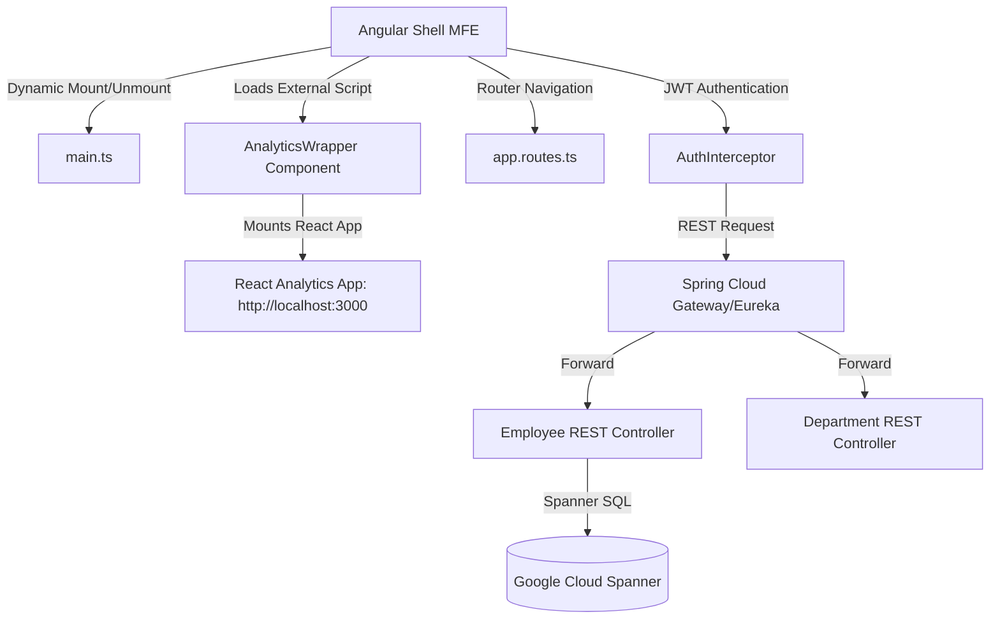

# End-to-End System Documentation: Angular Frontend

This document provides a detailed, line-by-line, and concept-by-concept breakdown of the **Employee Management UI** application. It serves as a guide to understand the components, services, models, routing, micro-frontend configuration, and why specific design patterns were chosen.

---

## 📖 Table of Contents
1. [Architectural Overview](#1-architectural-overview)
2. [Key Angular & Frontend Topics Covered](#2-key-angular--frontend-topics-covered)
3. [Deep-Dive: Global Configurations & Setup](#3-deep-dive-global-configurations--setup)
   - [Bootstrapping & Module Federation (`main.ts`)](#bootstrapping--module-federation-maints)
   - [Workspace Layout (`angular.json`)](#workspace-layout-angularjson)
   - [Environment Configurations (`environment.ts`)](#environment-configurations-environmentts)
4. [Deep-Dive: Core Services & Infrastructure](#4-deep-dive-core-services--infrastructure)
   - [HTTP Interceptors (`auth.interceptor.ts`, `error.interceptor.ts`)](#http-interceptors-authinterceptorts-errorinterceptorts)
   - [Guards (`auth.guard.ts`)](#guards-authguardts)
   - [API Services (`employee.service.ts`, `auth.service.ts`, `department.service.ts`)](#api-services-employeeservicets-authservicets-departmentservicets)
   - [Custom Validators (`strong-password.validator.ts`)](#custom-validators-strong-passwordvalidatorts)
5. [Deep-Dive: Standalone Components](#5-deep-dive-standalone-components)
   - [`NavbarComponent` & Internationalization](#navbarcomponent--internationalization)
   - [`HomeComponent`](#homecomponent)
   - [`LoginComponent` & `SignupComponent`](#logincomponent--signupcomponent)
   - [`EmployeeListComponent` (Pagination, Signals, Debounce)](#employeelistcomponent-pagination-signals-debounce)
   - [`CreateEmployeeComponent` & `EmployeeEditComponent`](#createemployeecomponent--employeeeditcomponent)
   - [`BulkInsertComponent` & `MultiEditComponent` (Reactive FormArrays)](#bulkinsertcomponent--multieditcomponent-reactive-formarrays)
   - [`AnalyticsWrapperComponent` (React Script Integration)](#analyticswrappercomponent-react-script-integration)
6. [Best Practices, Recommendations & Discovered Inconsistencies](#6-best-practices-recommendations--discovered-inconsistencies)

---

## 1. Architectural Overview

The application is structured as a **Micro-Frontend (MFE) compatible client shell** built on Angular 21. It manages employees and departments by communicating with a Spring Boot backend (running on Google Cloud Spanner).

### High-Level Architecture Flow



### Why this approach?
* **Standalone Architecture**: Simplifies dependencies and eliminates heavy `NgModule` files. Every component declares its own imports, which improves tree-shaking and initial page bundle sizes.
* **Micro-Frontend Ready**: Configured using `ngx-build-plus` so it can run either in Standalone mode or be dynamically mounted into a hosting Shell application using Module Federation hooks.
* **Runtime Integration (React)**: Loads the analytics dashboard dynamically via script loading and window-level mounting helpers, allowing developers to combine React and Angular codebases at runtime.

---

## 2. Key Angular & Frontend Topics Covered

This codebase serves as an excellent case study of modern, advanced Angular development. Here are the core topics implemented:

| Angular / Web Topic | Where It is Used | Why It was Chosen |
| :--- | :--- | :--- |
| **Standalone Components** | Every component in `features/`, `shared/` | Modern Angular recommendation; replaces legacy `NgModule` boilerplate, isolates component dependencies. |
| **Angular Signals** | `EmployeeListComponent` (`employees`, `loading`) | Replaces Zone.js dirty checking for local state. Provides fine-grained reactive updates directly to the DOM. |
| **Reactive FormArrays** | `BulkInsertComponent`, `MultiEditComponent` | Allows dynamic insertion, editing, validation, and deletion of repeating rows in a tabular spreadsheet-style input layout. |
| **HTTP Interceptors** | `AuthInterceptor`, `ErrorInterceptor` | Centralizes outgoing credential injection (JWT) and incoming response error handshakes (handling `401 Unauthorized` globally). |
| **Route Guards (`CanActivateFn`)** | `auth.guard.ts` | Functional guard that checks for auth tokens in storage before letting the user navigate to protected dashboards. |
| **RxJS Debouncing & Subjects** | `EmployeeListComponent` (`searchSubject`) | Uses `debounceTime(1000)` to delay the search API call until the user stops typing for 1 second, reducing API load. |
| **Internationalization (i18n)** | `NavbarComponent`, `ngx-translate` | Translates the UI into 12 languages (EN, ES, FR, DE, AR, HI, etc.) using dynamic JSON asset loading. |
| **Change Detection & NgZone** | `MultiEditComponent`, `LoginComponent` | Uses `NgZone.run()` and `ChangeDetectorRef.detectChanges()` to force UI updates when async operations happen outside Angular's default digest loop. |
| **State Passing via Navigation** | `LoginComponent`, `MultiEditComponent` | Uses router state (`history.state`) to pass selected datasets to another route without triggering secondary GET requests. |

---

## 3. Deep-Dive: Global Configurations & Setup

### Bootstrapping & Module Federation (`main.ts`)
The entry point exposes custom lifecycles to enable integration as a Micro-Frontend:

```typescript
export async function mount() {
  appRef = await bootstrapApplication(AppComponent, {
    providers: [
      provideRouter(routes),
      provideHttpClient(withInterceptorsFromDi()),
      { provide: HTTP_INTERCEPTORS, useClass: AuthInterceptor, multi: true },
      { provide: HTTP_INTERCEPTORS, useClass: ErrorInterceptor, multi: true },
      { provide: TranslateLoader, useFactory: HttpLoaderFactory, deps: [HttpClient] },
      { provide: TranslateCompiler, useClass: TranslateMessageFormatCompiler },
      { provide: TranslateParser, useClass: TranslateDefaultParser },
      { provide: MissingTranslationHandler, useClass: MyMissingTranslationHandler },
      TranslateStore,
      TranslateService,
    ],
  });
}

export async function unmount() {
  if (appRef) {
    appRef.destroy();
    appRef = null;
  }
}

if (!(window as any).__POWERED_BY_MODULE_FEDERATION__) {
  mount();
}
```

#### Line-by-Line Explanation:
* **Lines 31-48 (`mount()`)**: Bootstraps the application dynamically, configuring routing, HTTP clients, JWT interceptors, and language translation configurations.
* **Lines 51-56 (`unmount()`)**: Destroys the bootstrap references (`appRef.destroy()`). This prevents memory leaks if the hosting shell unmounts this Angular application.
* **Lines 59-61**: Detects if the app is running as a standalone client. If `__POWERED_BY_MODULE_FEDERATION__` is not present, it automatically boots itself up.

---

### Workspace Layout (`angular.json`)
The builder configuration leverages `ngx-build-plus` rather than standard `@angular-devkit/build-angular:browser`.

```json
"builder": "ngx-build-plus:browser",
"options": {
  "tsConfig": "tsconfig.app.json",
  "main": "src/main.ts",
  "polyfills": "src/polyfills.ts",
  "index": "src/index.html",
  "outputPath": "dist/employee-management-ui",
  "assets": [
    "src/favicon.ico",
    "src/assets"
  ],
  "styles": [
    "node_modules/bootstrap/dist/css/bootstrap.min.css",
    "src/styles.css"
  ],
  "extraWebpackConfig": "webpack.config.js",
  "commonChunk": false
}
```

* **`ngx-build-plus:browser`**: Extends Angular's CLI webpack process, allowing a custom `webpack.config.js` to run.
* **`extraWebpackConfig`**: Tells webpack to load Module Federation settings (such as shared core singletons and remote configuration) from `webpack.config.js`.
* **`commonChunk: false`**: Disables compilation of common chunk files to ensure separate runtime loading boundaries are maintained in MFE environments.

---

### Environment Configurations (`environment.ts`)
The environment configuration provides route endpoints for discrete backend services.

```typescript
export const environment = {
  production: false,
  apiBaseUrl: 'http://localhost:8080/employee-service',
  deptBaseUrl: 'http://localhost:8081/department-service'
};
```

* **`apiBaseUrl`**: Root URL for employee CRUD and bulk processes.
* **`deptBaseUrl`**: Root URL for department lookup endpoints.
* **Why two endpoints?** The backend is architected as microservices (running Eureka/Gateway), so different features interact with different host service URLs.

---

## 4. Deep-Dive: Core Services & Infrastructure

### HTTP Interceptors

#### 1. Authentication Interceptor (`auth.interceptor.ts`)
Intercepts all outgoing HTTP requests and appends the authorization header if a session token exists.

```typescript
intercept(req: HttpRequest<any>, next: HttpHandler): Observable<HttpEvent<any>> {
  const isAuthApi = req.url.includes('/login') || req.url.includes('/sign-up');
  if (isAuthApi) {
    return next.handle(req);
  }

  const token = sessionStorage.getItem('token');
  if (token) {
    req = req.clone({
      setHeaders: {
        Authorization: `Bearer ${token}`
      }
    });
  }
  return next.handle(req);
}
```

* **`isAuthApi` Check**: If the endpoint is `/login` or `/sign-up`, the interceptor forwards the request immediately. This avoids adding an undefined authorization header during initial authentication.
* **`req.clone()`**: In Angular, HTTP requests are immutable. To add authorization headers, we clone the request object and define the new headers using `setHeaders`.

---

#### 2. Global Error Interceptor (`error.interceptor.ts`)
Listens to all API responses. If it encounters a `401 Unauthorized` response, it signs out the user.

```typescript
return next.handle(req).pipe(
  catchError((error: HttpErrorResponse) => {
    const isAuthApi = req.url.includes('/login') || req.url.includes('/sign-up') || req.url.includes('/logout');

    if (error.status === 401 && !isAuthApi) {
      sessionStorage.removeItem('token');
      this.router.navigateByUrl('/login');
    }

    return throwError(() => error);
  })
);
```

* **Automatic Session Cleanup**: If the server rejects the client's token (token expired, blacklisted, etc.) and returns 401, the interceptor clears the client storage and routes them to `/login` to sign in again.
* **`throwError()`**: Re-throws the error block so that page components can still capture the API failure in their error callbacks.

---

### Guards (`auth.guard.ts`)
A lightweight router guard preventing unauthorized access to dashboards:

```typescript
export const authGuard: CanActivateFn = () => {
  const router = inject(Router);
  const token = sessionStorage.getItem('token');

  if (!token) {
    router.navigate(['/login']);
    return false;
  }
  return true;
};
```

* **Functional Guard Pattern**: Introduced in Angular 15+, functional guards replace class-based guards and allow injecting dependencies directly using the `inject()` token provider.

---

### API Services

#### `employee.service.ts`
Interacts with `/api/employees` backend routes. Notable methods:

* **`getEmployeesFilter(page, size, search)`**:
  Constructs a filtered request. If the search string exists, it appends it using `encodeURIComponent` to prevent query syntax injection.
* **`bulkDelete(ids)`**:
  Performs bulk removal. Uses `this.http.request('delete', ...)` to send a `DELETE` body containing the ID array, which standard `http.delete` doesn't support by default.
* **`bulkCreate(employees)` & `bulkUpdate(employees)`**:
  Sends array packages directly to backend controller bulk endpoints (`/bulk-create`, `/bulk-update`).

#### `auth.service.ts`
Authenticates user login, registration, and logout operations.
* *Note: Saves session states to `localStorage` internally, which is discussed in the [Discovered Inconsistencies](#6-best-practices-recommendations--discovered-inconsistencies) section.*

---

### Custom Validators (`strong-password.validator.ts`)
Checks if password fields meet security compliance criteria (numbers, symbols, case).

```typescript
export function strongPasswordValidator(control: AbstractControl): ValidationErrors | null {
  const value = control.value;
  if (!value) return null;

  const hasUpperCase = /[A-Z]/.test(value);
  const hasLowerCase = /[a-z]/.test(value);
  const hasNumber = /[0-9]/.test(value);
  const hasSpecialChar = /[!@#$%^&*(),.?":{}|<>]/.test(value);

  const valid = hasUpperCase && hasLowerCase && hasNumber && hasSpecialChar;
  return valid ? null : { strongPassword: true };
}
```

* **Regular Expression Assertions**: Validates that all password complexity rules are met. If any check fails, it returns the error object `{ strongPassword: true }`, which can be displayed in template error nodes.

---

## 5. Deep-Dive: Standalone Components

### `NavbarComponent` & Internationalization
* **Language Initialization**: Declares English as the default and loads translation configurations.
* **`changeLanguageEvent(event)`**: Extracts selection changes and translates the UI page text elements dynamically:
  ```typescript
  changeLanguageEvent(event: Event) {
    const selectElement = event.target as HTMLSelectElement;
    if (selectElement) {
      this.translate.use(selectElement.value);
    }
  }
  ```

---

### `HomeComponent`
* Acts as a light landing dashboard.
* Uses an `activeView` property (`'home' | 'login' | 'signup'`) to toggle rendering login or signup components directly inside the home viewport using component selector injection.

---

### `LoginComponent` & `SignupComponent`
* **Performance Logs**: Employs `console.time('TOTAL_LOGIN_FLOW')` and `console.timeEnd()` to measure authentication request performance.
* **`ngZone.run()` / `cdr.detectChanges()`**: When authentication responses trigger, they might arrive outside Angular's main check boundaries. Forcing manual change detection ensures error banners appear immediately.

---

### `EmployeeListComponent` (Pagination, Signals, Debounce)
This is the core view of the application, showing how Angular Signals and RxJS can work together.

```typescript

employees = signal<Employee[]>([]);
loading = signal(false);
private searchSubject = new Subject<string>();

constructor(...) {
  this.searchSubject.pipe(debounceTime(1000)).subscribe(term => {
    this.searchTerm = term;
    this.page = 0;
    this.loadEmployees();
  });
}
```

#### Why use Signals + RxJS here?
1. **Signal State (`employees()`)**: When the employee array is set via `this.employees.set(data)`, Angular only updates the template elements that bind directly to `employees()`. This makes updating the list highly efficient.
2. **RxJS Debouncing**: Handles user input. If a user rapidly types "Software Developer", it registers 18 key presses. Instead of sending 18 network requests, the `debounceTime(1000)` filters the stream, waiting until the user stops typing for 1 second before calling `loadEmployees()`.

---

### `CreateEmployeeComponent` & `EmployeeEditComponent`
These components use reactive forms to create and edit employee records.
* **`loadDepartments()` Callback Sequence**:
  In `EmployeeEditComponent`, `loadEmployee()` is called *only after* `loadDepartments()` completes successfully.
  ```typescript
  loadDepartments(): void {
    this.employeeService.getDepartments().subscribe({
      next: (res) => {
        this.departments = res;
        this.loadEmployee(); // Called sequentially
      }
    });
  }
  ```
  **Why?** This prevents race conditions. If `loadEmployee()` runs before the departments are loaded, mapping the department name to its ID (`this.departments.find(...)`) will fail and result in an empty department dropdown.

---

### `BulkInsertComponent` & `MultiEditComponent` (Reactive FormArrays)
These components allow editing multiple employees at once in a grid-like view.

```typescript
get employeesArray(): FormArray {
  return this.employeesForm.get('employees') as FormArray;
}
```

#### Why use FormArray for Bulk Operations?
* **Individual Row Validations**: Each row is configured as a standalone `FormGroup`. This ensures validation checks (like email formats or positive salary inputs) are run independently for each employee.
* **Dynamic Row Modifications**: Allows appending rows (`FormArray.push()`) or removing rows (`FormArray.removeAt(index)`) without resetting the data in other rows.
* **Routing State Optimization**:
  ```typescript
  const employees: EmployeeResponseDto[] = history.state.employees || [];
  employees.forEach(emp => this.addEmployeeRow(emp));
  ```
  **Why?** When performing a bulk update, the component reads the selected employee records from `history.state.employees`. This avoids making an extra API request to fetch those records.

---

### `AnalyticsWrapperComponent` (React Script Integration)
Renders a React-based Micro-Frontend application inside the Angular interface at runtime.

```typescript
private loadReactScript(): Promise<void> {
  return new Promise((resolve, reject) => {
    if (document.getElementById(this.scriptId)) {
      resolve();
      return;
    }
    const script = document.createElement('script');
    script.id = this.scriptId;
    script.src = 'http://localhost:3000/bundle.js';
    script.async = true;
    script.onload = () => resolve();
    script.onerror = (err) => reject(err);
    document.body.appendChild(script);
  });
}
```

#### Lifecycle mounting flow:
1. **`ngOnInit`**: Calls `loadReactScript()` to append a `<script>` tag pointing to `http://localhost:3000/bundle.js` to the page document body.
2. **Mounting**: Once loaded, it executes `window.mountReactAnalytics('react-analytics-root')` to render the React application inside a target `div`.
3. **`ngOnDestroy`**: When the user navigates away, it runs `window.unmountReactAnalytics('react-analytics-root')` to clean up React event listeners, prevent memory leaks, and remove the React DOM nodes.

---

## 6. Best Practices, Recommendations & Discovered Inconsistencies

During code review, the following architectural details were identified for optimization:

### ⚠️ Token Storage Location Inconsistency
There is a conflict between how the Authentication Service and other app elements read/write JWT authentication tokens:

```typescript
// 1. In auth.service.ts
login(...) {
  localStorage.setItem('token', response.token);
}

// 2. In login.component.ts
onSubmit() {
  sessionStorage.setItem('token', response.token);
}

// 3. In auth.interceptor.ts & auth.guard.ts
const token = sessionStorage.getItem('token');
```

* **Impact**:
  * If a user logs in via `LoginComponent`, the token is stored in both `localStorage` (via the service tap) and `sessionStorage` (via the component callback).
  * However, the interceptor and route guard check `sessionStorage`. If `sessionStorage` is cleared but `localStorage` persists, `isLoggedIn()` in `AuthService` will return `true`, but all API calls will fail with a 401 error because the interceptor will not find a token in `sessionStorage` to append to the request.
* **Resolution Recommendation**:
  Centralize token storage in a single storage provider (e.g. `sessionStorage` for tab-specific sessions or `localStorage` for persistent sessions) inside the `AuthService`. Avoid direct storage interaction in component controllers.

### 💡 Material SnackBar Alignment Configuration
In `EmployeeEditComponent`, custom layout styling classes are applied to the `MatSnackBar` configurations:

```typescript
this.snackBar.open('Employee updated successfully', 'Close', {
  duration: 5000,
  horizontalPosition: 'center',
  verticalPosition: 'top',
  panelClass: ['success-snackbar']
});
```

* **Why?** Since this app uses Bootstrap 5 alongside Angular Material, adding `panelClass` styling keys ensures snackbar colors match Bootstrap's warning/success color schemes.

---
